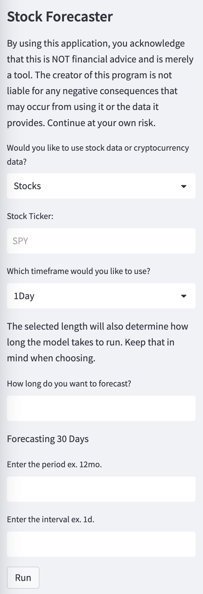
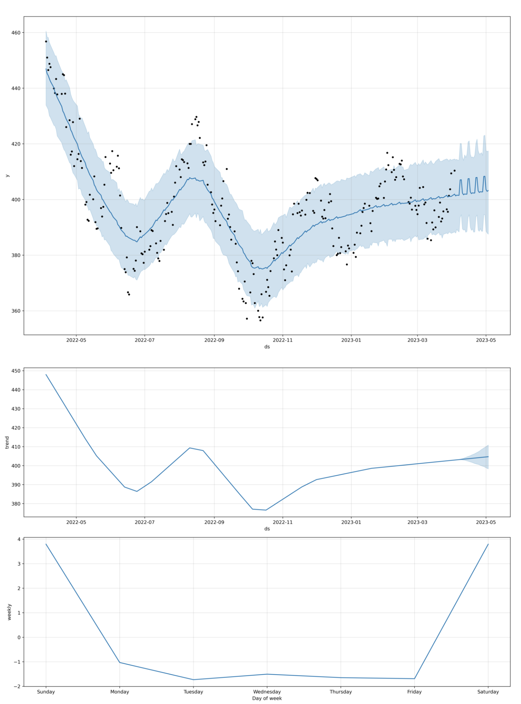

# Stock Forecaster

Web interface application utilizing Prophet library and Yahoo Finance API to provide stock forecasts and trend data. This application was designed for a client with the intention of creating a very simple to use system for non-technical users with minimal setup and detailed instructions while enabling easy access to machine learning tools for time series forecasting and trend analysis.

---

## Deployed App

You can try the app [here!](https://stock-forecasting.streamlit.app/) Hosted on Streamlit and accessible on the web or locally!

---

## Technologies

This project leverages python with the following packages:

* [Pandas](https://github.com/pandas-dev/pandas) - For plotting and dataframes.

* [Prophet](https://github.com/facebook/prophet) - For forecasting.

* [Yfinance](https://github.com/ranaroussi/yfinance.git) - For financial data from Yahoo Finance

* [Matplotlib](https://github.com/matplotlib/matplotlib) - For plotting.

* [Numpy](https://github.com/numpy/numpy) - For Prophet usage.

<!-- * [Pandas TA](https://github.com/twopirllc/pandas-ta) - For indicators. -->

* [Streamlit](https://github.com/streamlit/streamlit) - For deploying app in browser.

---

## Installation Guide

Before first running the application, it may be necessary to install the required dependencies. This can be done using traditional pip installation or the included install file (recommended).

To install using the install file, navigate to the project directory and run the following code:

```
python install.py install
```

This will run a subprocess to install all the dependencies in a single command. Alternatively, manual installation can be done as follows:

```
pip install pandas, prophet, matplotlib, datetime, numpy, prophet, streamlit, yfinance
```

---

## Usage

The easiest way to use this application is to visit the link towards the top of the document which will lead to the deployed version.

After the initial setup and install, the program can be run by typing the following into the terminal:

```
streamlit run app.py
```

As the program is opened, a financial disclaimer will appear to ensure the user is aware any risks that may arise from following the advice given by the software. The program intakes the following user data:

* Stock or Crypto data
* Ticker - ex. SPY or BTC
* Timeframe - Either 1Day, 1Hour or 1Min
* Forecast Length - Defaults are 30 days, 720 hours, or 1440 minutes
* Period - Period of data used. Default is 12 months
* Interval - Interval of data used. Default is 1 day

Many of these have default values outside of the stock ticker, which is required to run the program. After all values have been provided, the program will pull data using the Alpaca API, prepare it, use it with the Prophet model, and display a forecast plot and a trend plot.

Example outputs of the code are as follows:




---

## Contributors

Brought to you by Majid Kouki. You can reach me at [majidkpy@gmail.com](mailto:majidkpy@gmail.com).

---

## License

[](https://opensource.org/licenses/MIT)
