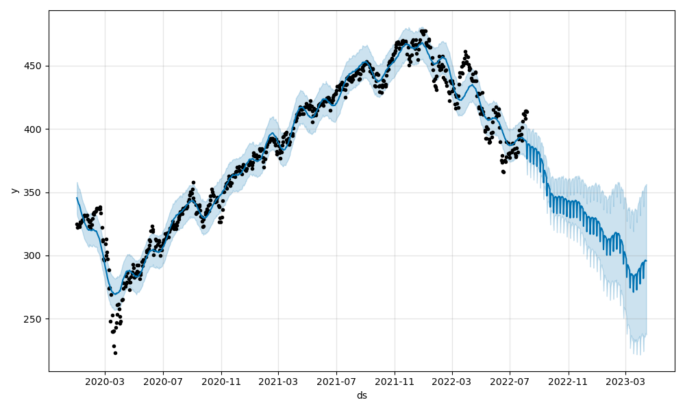
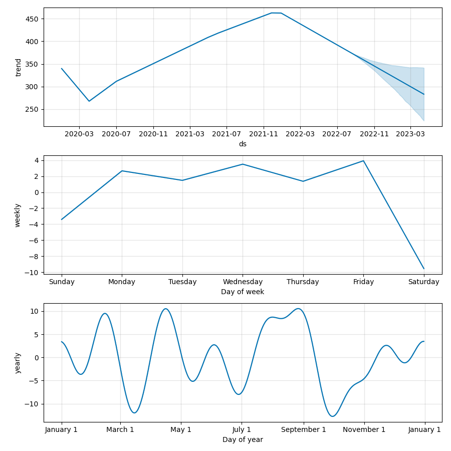

# Stock Forecasting CLI

Simple CLI application using Prophet library and Alpaca API to provide stock forecasts and trend data. This application was designed for a client with the intention of creating a very simple to use system for non-technical users with minimal setup and detailed instructions while enabling easy access to machine learning tools for time series forecasting and trend analysis.

---

## Technologies

This project leverages python with the following packages:

* [Pandas](https://github.com/pandas-dev/pandas) - For plotting and dataframes.

* [dotenv](https://pypi.org/project/python-dotenv/) - For accessing the .env file.

* [Prophet](https://github.com/facebook/prophet) - For forecasting.

* [Alpaca Trade API](https://github.com/alpacahq/alpaca-trade-api-python) - For financial data from [Alpaca](https://alpaca.markets)

* [fire](https://github.com/google/python-fire) - For the command line interface and entry-point.

* [questionary](https://github.com/tmbo/questionary) - For interactive user prompts and dialogs.

* [matplotlib](https://github.com/matplotlib/matplotlib) - For plotting.

* [numpy](https://github.com/numpy/numpy) - For Prophet usage.

---

## Installation Guide

Before first running the application, it may be necessary to install the required dependencies. This can be done using traditional pip installation or the included install file (recommended).

To install using the install file, navigate to the project directory and run the following code:

```
python install.py install
```

This will run a subprocess to install all the dependencies in a single command. Alternatively, manual installation can be done as follows:

```
pip install pandas, prophet, questionary, fire, matplotlib, datetime, numpy, prophet, python-dotenv, alpaca-trade-api
```

Next it will be necessary to populate a .env file with the necessary Alpaca API keys. Signing up with Alpaca is easy and allows future usage with data and trading APIs. An example.env file is included and can be used to store API data as long as it's properly renamed. Example of the .env:

```
ALPACA_API_KEY = "<Your API Key Here>"
ALPACA_SECRET_KEY = "<Your Secret Key Here>"
```

Once the API keys have been generated on the Alpaca website and the example.env has been populated, run the following command to properly rename:

```
mv example.env .env 
```

---

## Usage

After the initial setup and install, the program can be run by typing the following into the terminal:

```
python app.py
```

As the program is opened, a financial disclaimer will appear to ensure the user is aware any risks that may arise from following the advice given by the software. After agreeing to it, the program takes the following user data:

* Stock Ticker - ex. SPY
* Timeframe - Either 1Day, 1Hour or 1Min
* Forecast Length - Defaults are 30 days, 720 hours, or 1440 minutes
* Data Start Date - Default is 2018-01-01
* Data End Date - Default is current date on system
* Filename - Defaults are 1 & 2

Many of these have default values outside of the stock ticker, which is required to run the program. After all values have been provided, the program will pull data using the Alpaca API, prepare it, use it with the Prophet model, and save a forecast plot and a trend plot to the 'imgs' folder.

Example outputs of the code are as follows:




---

## Contributors

Brought to you by Majid Kouki. You can reach me at [majidkpy@gmail.com](mailto:majidkpy@gmail.com).

---

## License

[](https://opensource.org/licenses/MIT)